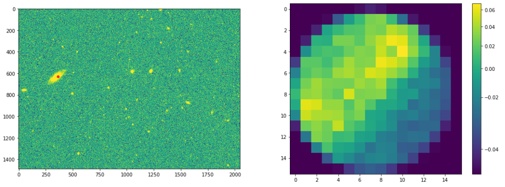

# SDSSphototools

Yukei S. Murakami (sterling.astro@berkeley.edu)

A set of helper tools to perform aperture photometry on SDSS images.
This tool is developed to provide photometric SED of the local environment where transient objects (SNe) are detected.

----------------------
## Requirements
Dependencies and required python packages

* python3 (tested w/ 3.7)
* numpy
* matplotlib
* pandas
* astropy
* photutils
* os
* glob
* bz2
* bs4
* urllib

TODO: add ```requirements.txt```

## usage
~~~~.python
import SDSSphototools as spt
import astropy.units as u

RA = 359.738
Dec = -2.248
z = 0.0254
r = 1.5 * u.kpc
name = 'SN2003he_host'

files,magdata = spt.do_photometry_radec(RA,Dec,z,r,name=name,show_plots=True)
~~~~

The program will print magnitudes in different methods, downloaded image containing the target coordinate, and masked image of the aperture.

e.g.

~~~~
* querying data...
* downloading image files...
* decompressing image files...
* performing photometry...
              u       g        r        i        z
asinh   19.1982  17.943  17.2641  16.9038  16.6108
pogson  19.1982  17.943  17.2641  16.9038  16.6108
~~~~



## issues & todo

* SN subtraction
* psf mag, other methods
* more flexible aperture arguments (maybe add ```r_angle=None``` as an optional argument?)
* **get uncertainties**
